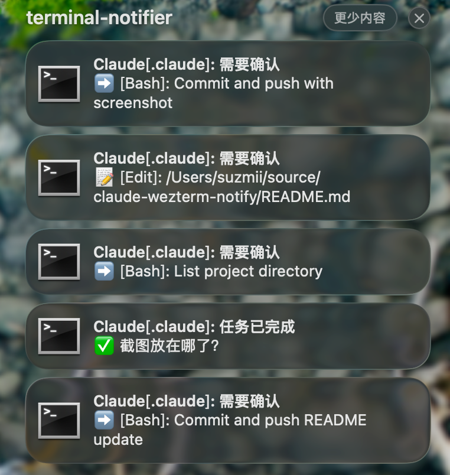

# Claude WezTerm Notify

Claude Code 的 WezTerm 终端通知钩子。当 Claude 需要确认操作或完成任务时，通过 macOS 系统通知提醒你。

## 效果预览



## 通知样式

- ➡️ Bash 命令执行
- 📝 文件读写操作（Write/Edit/Read）
- ⚙️ 其他工具
- ✅ 任务完成
- 💬 等待用户输入

## 依赖

- macOS（其他平台未测试，欢迎 PR）
- [WezTerm](https://wezfurlong.org/wezterm/) 终端
- [terminal-notifier](https://github.com/julienXX/terminal-notifier)
- jq

```bash
brew install wezterm terminal-notifier jq
```

安装后请在 **系统设置 → 通知** 中给 `terminal-notifier` 开启通知权限，否则通知不会显示。

## 安装

```bash
git clone https://github.com/suzmii/claude-wezterm-notify.git
cd claude-wezterm-notify
./install.sh
```

安装脚本会自动复制脚本到 `~/.claude/` 并配置 hooks，不影响已有配置。重启 Claude Code 生效。

## 点击通知

点击通知会自动激活 WezTerm 窗口并聚焦到触发通知的面板。

## 卸载

```bash
./uninstall.sh
```

会移除脚本和 settings.json 中的 hook 配置，不影响其他 hooks。

## License

MIT
